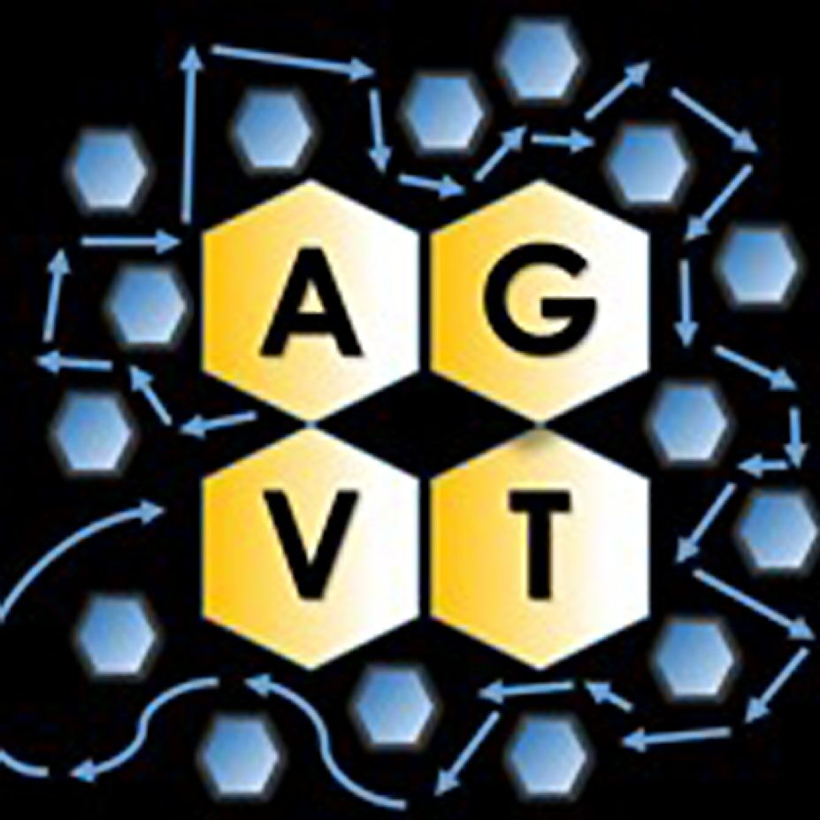

# Welcome to the Kennesaw Autonomous Ground Vehicle Team

This repository contains many helpful tutorials on topics and methods used in the software development process over the course of a year on this team. This includes:
* Working with GitHub (Version Control System) to allow multiple people to work on the same code base, as well as backup any feature releases
* Working with the Robot Operating System (ROS) To develop multi-computer robots as well as fragment operations
* Utilzing Computer Vision techniques through libraries like OpenCV to manipulate video feeds into usable data for object detection and lane detection
* Understanding the basics of machine learning, and implementing basic neural networks through python libary Keras
* Condense LIDAR data to be more computationally efficent, and develop basic processing techniques using the Point Cloud Library (PCL)
* Simulating sensorimotor feedback through ROS package Gazebo to allow for algorithm testing when access to the physical vehicle is limited